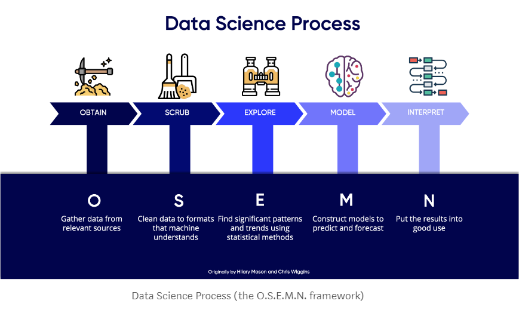

# NEW YORK TIMES BEST SELLING BOOKS ANALYSIS

## Introduction

## Table of Contents

  * Goodreads API Fetching: <a href="https://github.com/linhmai19/capstone_project/blob/master/goodreads_api.ipynb">goodreads_api.ipynb</a>
  * Data Cleaning Process: <a href="https://github.com/linhmai19/capstone_project/blob/master/dataset_cleaning.ipynb">dataset_cleaning.ipynb</a>
  * Datasets Merging: <a href="https://github.com/linhmai19/capstone_project/blob/master/dataframes_merging.ipynb">dataframes_merging.ipynb</a>
  * EDA and Classification Modeling: <a href="https://github.com/linhmai19/capstone_project/blob/master/eda_clf_modeling.ipynb">eda_clf_modeling.ipynb</a>

## Methodology

Throughout this project, I am using various components of data science process, depending on the research questions at hand. However, the overall project from start to finish adheres to the OSEMN framework:

### 1) Obtaining the raw data

The already existing dataset was obtained from the website called data.world. This dataset is the list of New York Times Bestseller Books from 2011 to 2018. Additional data about was obtained by fetching Goodreads API. 

  * Existing Dataset from data.world: 
  
    <a href="https://data.world/typhon/new-york-times-bestsellers-from-2011-to-2018">New York Times Bestsellers from 2011 to 2018</a>

  * Book Review Statistics Data from Goodreads API:

    <a href="https://www.goodreads.com/api/index#book.review_counts">Book Review Statistics given a list of ISBNs</a>

### 2) Scrubbing or Data Cleaning 

Because of the heavy imbalance between two classes, the dataset was sliced to the books that have number of weeks on New York Times Bestsellers list less than or equal to 40 weeks. Another column was created to convert the dataset to binary classification model to predict whether a book will be on the best seller list more than 5 weeks and what factors that cause the results.

  * Cleaned dataset for the New York Times Bestseller list: <a href="https://github.com/linhmai19/capstone_project/blob/master/cleaned_books.csv">cleaned_books.csv</a>
  * Dataset from Goodreads API: <a href="https://github.com/linhmai19/capstone_project/blob/master/review_stats.csv">review_stats.csv</a>
  * Further cleaning and merging the two datasets into one dataframe: <a href="https://github.com/linhmai19/capstone_project/blob/master/merge_data.csv">merge_data.csv</a>
  * Further cleaning the original dataset for modeling and comparation with the merged dateset: <a href="https://github.com/linhmai19/capstone_project/blob/master/cleaned_books_modeling.csv">cleaned_books_modeling.csv</a>

### 3) Exploring or EDA

Initial exploration was conducted to visualize the balance between two classes, to understand how variables behaved in relation to the target variable and to each other, to visualize the continuous data prior to scaling using StandardScaler and the categorical data prior to label encoding using get_dummies

### 4) Classification Modeling 

Modeling process was done with 2 different datasets: the merged dataset with additional data/features about the review statistics and the original dataset with no features about the review statistics to compare the performance.

Baseline model was produced with Statsmodel's Ordinary Least Squares. Hyperparameter tuning with GridSearchCV with five models:
  * Random Forest
  * K-Nearest Neighbor
  * Decision Tree
  * XGBoost
  * Neural Network - MLP Classifier

### 5) Result Interpretation 

By calculating metrics, conducting confusion matrices, and plotting Receiver Operating Characteristic (ROC) curves between models, the top 3 final models with the best performance were chosen. The most 5 important features were also chosen by Random Forest to understand the factors that cause a book to be on New York Times Bestsellers list less than 5 weeks. 

## Presentation
- Presentation Slides: <a href="https://github.com/linhmai19/capstone_project/blob/master/bestsellers_presentation.pdf">Best Selling Books Presentation</a>

- Oral Presenation: <a href="https://github.com/linhmai19/capstone_project/blob/master/NYTB_oral_presentation.mp4">Best Selling Books Oral Presentation</a>

- Blog Post: <a href="https://medium.com/@linhnp.mai/new-york-times-bestseller-analysis-e349a79b9734">Best Selling Books</a>